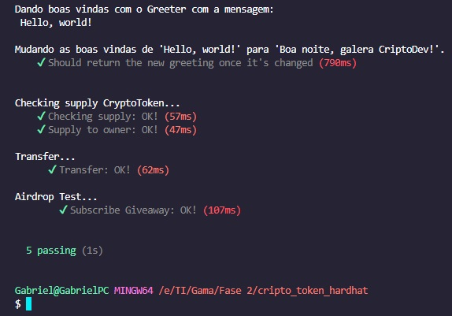

# Project Hardhat CriptoDev Token

Projeto criado no curso Cripto Dev, desenvolvimento de um contrato de token e de um airdrop para o token com testes unitários desenvolvido com a biblioteca hardhat.

<div align="center">
  
</div>

<br/>

### Passos

1) Criação do projeto
    - npm init -y

2) Instalação do Hardhat como dependência
    - npm i --save-dev hardhat

3) Criação do projeto hardhat;
    - npx hardhat

4) Instalando as dependencias necessárias
    - npm install --save-dev @nomiclabs/hardhat-ethers ethers @nomiclabs/hardhat-waffle ethereum-waffle chai

5) Desenvolvimento do contrato do token

6) Compilando o contrato do token
    - npm hardhat compile

7) Desenvolvimento dos testes unitários para o contrato do token

8) Desenvolvimento do contrato do airdrop

9) Compilando o contrato do airdrop
    - npm hardhat compile

10) Desenvolvimento dos testes unitários para o contrato do airdrop.

# Basic Sample Hardhat Project

This project demonstrates a basic Hardhat use case. It comes with a sample contract, a test for that contract, a sample script that deploys that contract, and an example of a task implementation, which simply lists the available accounts.

Try running some of the following tasks:

```shell
npx hardhat accounts
npx hardhat compile
npx hardhat clean
npx hardhat test
npx hardhat node
node scripts/sample-script.js
npx hardhat help
```
